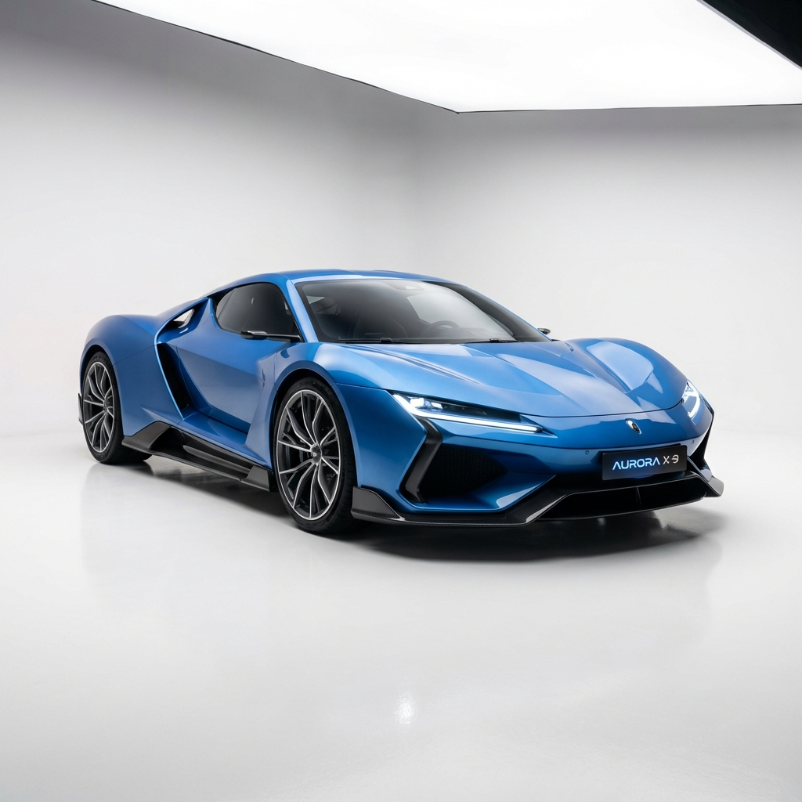

# 🚗 NovaDrive - E-commerce de Autos Deportivos



## 🌟 Descripción

**NovaDrive** es una plataforma e-commerce premium para la venta de autos deportivos, supercars y hypercars modernos. Diseñado con las últimas tecnologías web y un enfoque en la experiencia de usuario excepcional.

## 🎨 Paleta de Colores

El diseño utiliza una paleta de colores moderna y vibrante:

- **Primary Blue**: `#3B82F6` - Color principal para elementos destacados
- **Primary Light**: `#60A5FA` - Variante clara para gradientes y hover states
- **Primary Dark**: `#1E3A8A` - Tonos oscuros para contraste y profundidad
- **Primary Lightest**: `#E0F2FE` - Fondos sutiles y elementos de UI ligeros

## ✨ Características

### Diseño Premium
- ✅ Interfaz moderna con gradientes y animaciones suaves
- ✅ Diseño responsive para todos los dispositivos
- ✅ Tipografía personalizada (Inter + Orbitron)
- ✅ Micro-animaciones para mejor UX
- ✅ Efectos de glassmorphism y sombras dinámicas

### Funcionalidades
- 🚀 **Hero Section** - Presentación impactante con estadísticas
- ⭐ **Autos Destacados** - Showcase de los mejores modelos
- 🔍 **Catálogo Filtrable** - Sistema de filtros por categoría
- 📊 **Especificaciones Detalladas** - Velocidad, aceleración, precio
- 🏢 **Sección About** - Historia y valores de la marca
- 📧 **Formulario de Contacto** - Comunicación directa con clientes
- 📱 **Navegación Móvil** - Menú hamburguesa responsive

### Categorías de Autos
- **Sports** - Autos deportivos de alto rendimiento
- **Supercar** - Supercars de lujo
- **Hypercar** - Hypercars de edición limitada

## 🛠️ Tecnologías

- **Framework**: Angular 21
- **Lenguaje**: TypeScript 5.9
- **Estilos**: CSS3 con variables personalizadas
- **Fuentes**: Google Fonts (Inter, Orbitron)
- **SSR**: Angular Universal para mejor SEO
- **Build Tool**: Angular CLI

## 📦 Instalación

### Prerrequisitos
- Node.js 20+ 
- npm o pnpm

### Pasos

1. **Clonar el repositorio**
```bash
git clone <repository-url>
cd web_autos
```

2. **Instalar dependencias**
```bash
npm install
# o
pnpm install
```

3. **Ejecutar servidor de desarrollo**
```bash
npm start
# o
pnpm start
```

4. **Abrir en el navegador**
```
http://localhost:4200
```

## 🚀 Scripts Disponibles

- `npm start` - Inicia el servidor de desarrollo
- `npm run build` - Construye la aplicación para producción
- `npm run watch` - Construye en modo watch para desarrollo
- `npm test` - Ejecuta las pruebas unitarias
- `npm run serve:ssr:web_autos` - Ejecuta la aplicación con SSR

## 📁 Estructura del Proyecto

```
web_autos/
├── src/
│   ├── app/
│   │   ├── app.component.ts      # Componente principal
│   │   ├── app.component.html    # Template HTML
│   │   ├── app.component.css     # Estilos del componente
│   │   └── app.config.ts         # Configuración de Angular
│   ├── styles.css                # Estilos globales y design system
│   └── index.html                # HTML principal con SEO
├── public/
│   └── assets/                   # Imágenes y recursos
│       ├── hero-car.png          # Auto hero principal
│       ├── car1.svg - car6.svg   # Autos del catálogo
│       └── about.svg             # Imagen de la fábrica
└── package.json
```

## 🎯 Catálogo de Autos

### Autos Destacados

1. **Phantom GT-R** - Supercar
   - Precio: $125,000 USD
   - Velocidad: 320 km/h
   - Aceleración: 0-100 en 2.8s

2. **Velocity X** - Sports
   - Precio: $98,000 USD
   - Velocidad: 290 km/h
   - Aceleración: 0-100 en 3.2s

3. **Thunder RS** - Hypercar
   - Precio: $156,000 USD
   - Velocidad: 350 km/h
   - Aceleración: 0-100 en 2.5s

### Catálogo Completo

4. **Storm Elite** - Sports ($89,000)
5. **Apex Pro** - Supercar ($112,000)
6. **Fusion Z** - Sports ($95,000)

## 🎨 Sistema de Diseño

### Variables CSS Principales

```css
/* Colores */
--primary-blue: #3B82F6;
--primary-light: #60A5FA;
--primary-dark: #1E3A8A;
--primary-lightest: #E0F2FE;

/* Tipografía */
--font-primary: 'Inter', sans-serif;
--font-display: 'Orbitron', sans-serif;

/* Espaciado */
--spacing-sm: 1rem;
--spacing-md: 1.5rem;
--spacing-lg: 2rem;
--spacing-xl: 3rem;

/* Sombras */
--shadow-md: 0 4px 6px -1px rgba(0, 0, 0, 0.1);
--shadow-xl: 0 20px 25px -5px rgba(0, 0, 0, 0.1);
--shadow-glow: 0 0 20px rgba(59, 130, 246, 0.4);
```

### Componentes Reutilizables

- **Botones**: `.btn`, `.btn-primary`, `.btn-secondary`, `.btn-dark`
- **Cards**: `.card`, `.featured-card`, `.catalog-card`
- **Badges**: `.badge`, `.badge-outline`
- **Grid**: `.grid`, `.grid-2`, `.grid-3`, `.grid-4`

## 🌐 SEO Optimizado

El sitio incluye:
- ✅ Meta tags descriptivos
- ✅ Open Graph para redes sociales
- ✅ Twitter Cards
- ✅ Estructura semántica HTML5
- ✅ Títulos y descripciones optimizados
- ✅ Server-Side Rendering (SSR)

## 📱 Responsive Design

Breakpoints:
- **Desktop**: > 1024px
- **Tablet**: 768px - 1024px
- **Mobile**: < 768px

## 🚀 Próximas Características

- [ ] Sistema de carrito de compras
- [ ] Integración con pasarela de pagos
- [ ] Comparador de autos
- [ ] Vista 360° de los vehículos
- [ ] Sistema de reservas online
- [ ] Chat en vivo
- [ ] Calculadora de financiamiento
- [ ] Galería de imágenes expandida

## 📄 Licencia

Este proyecto es parte de un portafolio educativo.

## 👨‍💻 Autor

Desarrollado con ❤️ para los amantes de la velocidad

---

**NovaDrive** - Redefiniendo el futuro de la conducción deportiva
